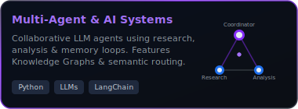
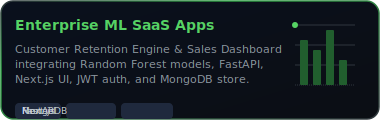

---

##  About Me

I am an **AI Engineer and Full-Stack Developer** passionate about building predictive systems, deep vision architectures, and scalable intelligent applications. My work focuses on bridging the gap between raw research (like neural networks and low-level code) and state-of-the-art web dashboards.

I love exploring the frontier of **Agentic AI systems**, **explainable machine learning**, and **low-level x86 optimization**, while maintaining production-grade web systems.

---

##  Featured Projects

 

<table border="0" cellpadding="0" cellspacing="0">
  <tr>
    <td valign="top" style="padding: 10px;">
      
    </td>
    <td valign="top" style="padding: 10px;">
      
    </td>
  </tr>
  <tr>
    <td valign="top" style="padding: 10px;">
      
    </td>
    <td valign="top" style="padding: 10px;">
      
    </td>
  </tr>
</table>

---

##  Tech Stack & Skills

  
<b> AI, Machine Learning &amp; Computer Vision</b>

   
  

    
    
    
    
    
    
  

  <ul>
    <li><b>Agentic Workflows:</b> Multi-Agent orchestration, Tool-Calling loops, Agentic Memory databases.</li>
    <li><b>Deep Architectures:</b> Hybrid CNN-Attention U-Net segmentations, custom residual blocks.</li>
    <li><b>Explainable AI (XAI):</b> Explainable KNN modeling, features mapping.</li>
    <li><b>CV Algorithms:</b> Fingertip tracking (MediaPipe), Convex Hull boundary detection (Graham Scan), GLCM texture analysis.</li>
  </ul>

 

  
<b> Full-Stack &amp; Systems Engineering</b>

   
  

    
    
    
    
    
  

  

    
    
    
    
    
    
  

  <ul>
    <li><b>Stateful Authentication:</b> JWT dual-token lifecycles, Role-Based Access Control (RBAC).</li>
    <li><b>Low-Level:</b> x86 Assembly console integrations, registers management (Irvine32 runtime).</li>
    <li><b>Language Tooling:</b> Multi-language transpilation to executable Python syntax (**UniversalPython**).</li>
  </ul>

 

  
<b> Databases, Cloud &amp; Tooling</b>

   
  

    
    
    
    
    
    
    
  </g>

---

##  Roadmap & Directions

<table border="0" width="100%">
  <tr>
    <td width="50%" valign="top">
      <h3> Current Focus</h3>
      <ul>
        <li>Deep neural network configurations (U-Net &amp; attention models)</li>
        <li>Agentic architectures &amp; LLM tool-calling orchestration</li>
        <li>Dual-token authentication subsystems with RBAC security</li>
        <li>Low-level structural assembly (x86 systems logic)</li>
      </ul>
    </td>
    <td width="50%" valign="top">
      <h3> Learning Path</h3>
      <ul>
        <li>Distributed data engineering pipelines &amp; scaling parameters</li>
        <li>Natural Language Processing and semantic knowledge graphs</li>
        <li>Distributed vector database indices and embeddings</li>
        <li>Modern UI frameworks (Next.js server actions / hooks)</li>
      </ul>
    </td>
  </tr>
</table>

---

##  Activity & Contributions

<table border="0" width="100%">
  <tr>
    <td width="50%" align="center">
      <h4> Contribution Streak</h4>
      
    </td>
    <td width="50%" align="center">
      <h4> Development Activity Graph</h4>
      
    </td>
  </tr>
</table>

---

##  Connect with Me

  
  

 

